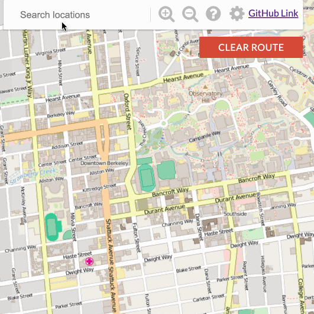
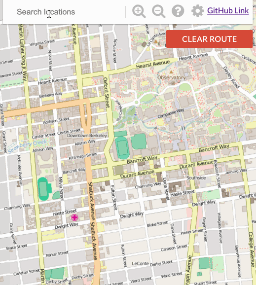

# Bear-Maps

Bear map is a Berkeley city map web application, on which users can view and access the geographic Information.

Website: http://150.136.140.87:4567

This application is based on [CS 61B Data Structures - UC Berkeley](https://sp18.datastructur.es/)

Thanks to [Jush Hug](https://www2.eecs.berkeley.edu/Faculty/Homepages/joshhug.html) and [Alan Yao](https://www.linkedin.com/in/alanyao/) for their fantastic framework!

This map has several features:

- An Autocomplete system where a user types in a partial query string, like “ci”, and is returned a list of locations that have “ci” as a prefix by implementing a Trie data stucture
- A location search function for users to find locations whose cleaned name match the cleaned query string exactly, and the web application will draw red dot markers on each of the matching locations.
- A turn-by-turn navigation function which draws a closest route using A* search algorithm and generates a sequence of navigation instructions

**Here shows the above functions:**
1. Autocomplete



2. Location Search



3. Turn-by-turn Navigation


## Classes
### [Rasterer](src/main/java/Rasterer.java)
Map Rastering (API)

This class provides all code necessary to take a query box and produce
a query result.

Renders map images given a user's requested area and level of zoom

### [GraphDB](src/main/java/GraphDB.java)
Graph for storing all of the intersection (vertex) and road (edge) information.

The GraphDB class will read in the Open Street Map dataset([berkeley-2018.osm.xml](src/static/berkeley-2018.osm.xml)) and store it as a graph. Each node in the graph will represent a single intersection, and each edge will represent a road. 

### [GraphBuildingHandler](src/main/java/GraphBuildingHandler.java)
Handler for parsing the Open Street Map XML file.

Parses OSM XML files using an XML SAX parser. Used to construct the graph of roads for pathfinding, under some constraints.

### [Router](src/main/java/Router.java)
This class provides a shortestPath method for finding routes between two points on the map.

Start by using Dijkstra's, and upgrade implementation by switching it to A*.

### [Solver](src/main/java/Solver.java)
A* search algorithm implementation.

### [Trie](src/main/java/Trie.java)
Data structure trie for autocomplete system.

## Test, Build, and Deployment
- [x] Test with JUnit - [Test file](src/test/java)
- [x] Built by Maven - [Maven file](pom.xml) 
- [x] Deployed on my Ubuntu server - [web link](http://129.153.177.66:4567)

You can also down my built jar file [here](out/artifacts/bearmaps/bearmaps.jar)
Then run on your local machine:
```
java -jar bearmaps.jar
```
Now you can go to http://0.0.0.0:4567 to see your map.

## Minor changes when you want to deploy this map project
1. Change from `File` and `FileInputStream` to `Thread.currentThread().getContextClassLoader().getResourceAsStream(dbPath)`
https://github.com/ZhiyuanMa2017/Bear-Maps/blob/3af5f19c4bfb9c7b76ba2271ce0e903dc4956e42/src/main/java/GraphDB.java#L83-L91

2. Change from `File` to `Thread.currentThread().getContextClassLoader().getResourceAsStream(imgPath)`
   https://github.com/ZhiyuanMa2017/Bear-Maps/blob/5d517899bf02c5d97d131146bda87863ae574159/src/main/java/MapServer.java#L286-L288

Now you can build your jar file and deploy it on your local machine or on your server.
